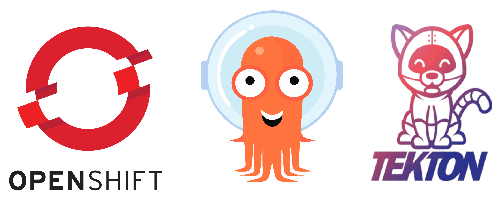

# NodeJS Deployment with Tekton-Pipeline & ArgoCD With Helm Chart #

## Prepare Work Enviourment ##
* Have Openshift 4.10 Platform
* Installed:
    - Openshift Git-Ops Operator
    - Openshift Pipeline Operator
* VScode

### Links ###
* Openshift:
  - Download Openshift local to work on your workstation [Openshift Local](https://developers.redhat.com/download-manager/link/3868678)
  - use a free Sandbox [Openshift developer sendbox](https://developers.redhat.com/content-gateway/link/3870099)
* How to Install:
  - Openshift Git-Ops Operator [GitOps Operator](https://docs.openshift.com/container-platform/4.10/cicd/gitops/installing-openshift-gitops.html)
  - Openshfit Pipelines Operator [Pipeline Operator](https://docs.openshift.com/container-platform/4.10/cicd/pipelines/installing-pipelines.html)
* Get VScode:
  - [Download](https://code.visualstudio.com/download)

### Getting around the repositoy ###
* Folders:
  - ArgoCD: this folder have 3 a sub-folder deploys, that hold 3 ArgoCD artifacs ordered in seperate folders
      - Argo Apps, Holds ArgoCD Application YAML
      - Argo Project, Holds ArgoCD Project YAML
      - Argo Repository, Holds ArgoCD Repository YAML(Secret)
      > Under ArgoCD we have 2 Tempalte YAML for ArgoCD app and ArgoCD Project, that will be copied to the respected sub-folder in the deployment stage.
  - ContainerFile: Holds that Containerfile for the image build and the src folder with the nodejs application.
  - Helm: helm chart and values for the deployment
  - Pipeline: holds the Pipeline and Task YAML for Tekton.

